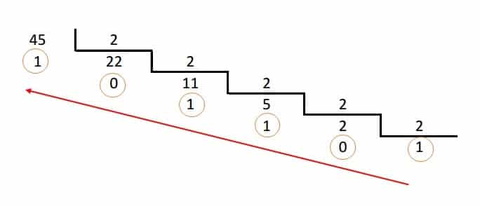

<h1 align = center>Sistemas computacionais e Segurança</h1>

## Aula 01 - Introdução e conversão de binários

// Sem anotações

## Aula 02 - Comandos Prompt CMD

- **`dir`** -> Listar conteúdo dentro da pasta;

- **`mkdir "nome-pasta"`** -> Cria uma nova pasta;

- **`cd nome-pasta`** -> Navega pelas pastas;

- **`cd ..`** -> Retorna a pasta anterior;

- **`cls`** -> Limpa o Prompt;

- **`copy origem-pasta destino-pasta`** -> Copia um arquivo desejado para outra pasta;

## Aula 03 - Introdução ao Linux

- O Linux é um sistema operacional de código aberto que hoje conta com uma legião de programadores e usuários empenhados, graças a essa característica, atualmente esse sistema vem ganhando muito terreno entre usuários e empresas.

### Características do Linux

- O Linux é um [**software livre**](https://www.udesc.br/arquivos/ceavi/id_cpmenu/291/o_que_e_software_livre_15380743475394_291.pdf) 

- É um programa **multitarefa real** (dois programas executando ao mesmo tempo)

- **Multiusuário** (mais de um usuário usando recursos do sistema ao mesmo tempo)

- Modularização - O Linux somente carrega para a memória o que é usado durante o processamento, liberando totalmente a memória assim que o programa/dispositivo é finalizado.

- Não precisa de um processador potente para funcionar. O sistema roda bem em computadores 386Sx 25 com 4mb de memória RAM.

- **Linux é menos vulnerável a vírus** devido a separação de privilégios entre processos e respeitadas as recomendações padrão de política de segurança e uso de contas privilegiadas (como a de root), programas como vírus tornam-se inúteis pois tem a sua ação limitada pelas restrições de acesso do sistema de arquivos e execução.

### Kernel

- Kernel é o núcleo do [Sistema Operacional](https://www.buscape.com.br/notebook/conteudo/o-que-e-sistema-operacional).

- Ele representa a camada mais baixa de interface com o hardware, sendo responsável por gerenciar os recursos do sistema computacional como um todo.

### Acessando um servidor Linux

- É possível acessar de maneira prática de duas formas:
    - Utilizando o Prompt do Windows
    - Utilizando um aplicativo, no caso utilizamos o (PuTTY)

### Utilizando o prompt

- Utilize o comando **`ssh 18.228.210.196 -l "<login-fornecido>"`**
    - Na primeira vez que acessar, será necessário aceitar o certificado do servidor digitando **`yes`**
    **Obs: Por questões de segurança não irá aparecer a os caracteres da senha no terminal**
    - Apos utilizar a senha correta, aparecerá a tela de prompt do Linux.

### Utilizando o PuTTY

- Selecione o arquivo putty.reg, clique com o botão direito do mouse, e na sequência clique em mesclar
- Confirme a alteração de dados no registro do Windows.

- Execute o aplicativo putty._**exe**_

- Clique duas vezes no nome **"Linux"** e a conexão será estabelecida

- Utilize as primeiras letras do seu nome e após isso utilize a senha padrão: una2023
    
    **Lembrando: Por questões de segurança não irá aparecer a os caracteres da senha no terminal**

## Aula 04 - Conversão de Binários

- Como converter o binário para decimal:

- Jogo para treinar binário: [Binary Game](https://learningcontent.cisco.com/games/binary/index.html)

### Conversão de decimal para binário

- Método divisão e resto:

- Deve sempre ser divido pela base, por exemplo, se for decimal para octal a base deve mudar para 8.

### Hexadecimal

- Tabela de hexadecimal:

- Meio byte se chama nibble

- ED^16 = 0xED, isso significa que o número após o "x" está em hexadecimal.

### Adição de binários

-   1 + 1 = 0 e vai 1

    0 + 0 = 0

    1 + 0 = 1
    
    

### Overflow

É quando um byte estoura, exemplo, um byte pode chegar no máximo á 255 e acontece um "overflow" quando ultrapassa este valor

- Exemplo:
    
    
